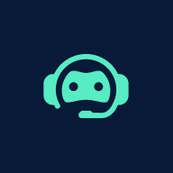
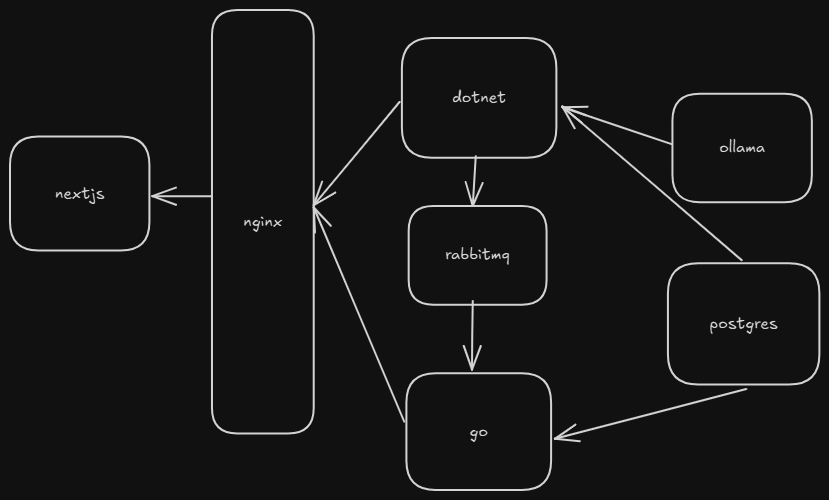

<h1 align="center">
   
      
   
    Personal AI Chatbot
</h1>

## Description

Run a fully local, Docker-first personal AI chatbot that puts you in control of your AI interactions. This project enables you to:

- Run a completely local AI chatbot with no data leaving your machine
- Customize the system prompt to shape your AI's personality
- Manage multiple conversations
- Deploy easily using Docker for consistent performance across environments
- Enjoy a modern and responsive web interface for seamless interaction

## Getting Started

### Development Mode

To run the app in development mode, where code changes are hot reloaded, run `dev.sh`

### Production Mode

To run the app in production mode, run `prod.sh`

## Architecture Overview

The system is built with a microservices architecture, ensuring scalability and maintainability while keeping all operations local:

### Services

#### Next.js

- Serves as the main entry point for users to interact with the chatbot

#### Nginx

- Routes requests to appropriate microservices

#### .NET (ASP.NET Core)

- Manages database migrations
- Handles chat requests and conversation management
- Produces logs for system monitoring
- Communicates with the AI model service

#### RabbitMQ

- Handles asynchronous communication between services
- Manages log streaming from the .NET service
- Ensures reliable message delivery

#### Go

- Consumes logs from RabbitMQ
- Processes and stores logs in the database
- Exposes a REST API for log consumption

#### PostgreSQL

- Stores conversations, messages, and logs

#### Ollama

- Runs the Llama 3 model locally
- Powers the chat functionality
- Ensures complete privacy by keeping AI processing on-premises
